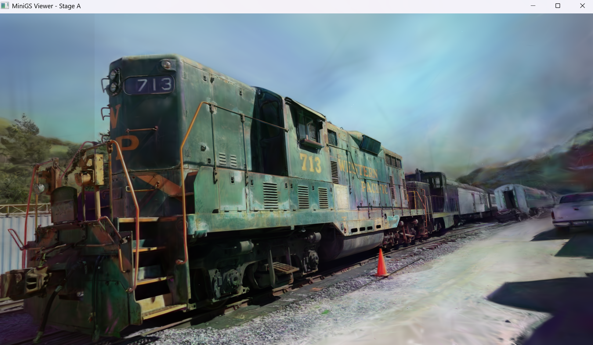

# MiniGSRenderer

A minimal Gaussian Splat renderer with both CPU and CUDA paths, plus interactive viewers.


## Quick Start

```bash
# Configure and build (Windows example)
cmake -S . -B build
cmake --build build --config Release

# Binaries are in build/Release
```

## Apps

- **MiniGSRenderer.exe**: Offline renderer (CPU or CUDA) saving PNG output.
  - Usage:
    ```bash
    MiniGSRenderer.exe --scene <file.ply> --output <out.png> [--camera_config cameras.json] [--cam_id N] [--cuda]
    ```
  - Examples:
    ```bash
    MiniGSRenderer.exe --scene train.ply --output out.png --camera_config cameras.json --cam_id 2
    MiniGSRenderer.exe --scene train.ply --output out_cuda.png --camera_config cameras.json --cam_id 2 --cuda
    ```

- **viewer_main.exe**: Interactive viewer with real-time reprojection and CUDA PBO display.
  - Usage:
    ```bash
    viewer_main.exe <file.ply> [camera_config.json] [camera_id]
    ```
  - Controls: WASD move, Q/E up/down, Shift for speed, Mouse to look, ESC to quit.

- **viewer_progressive.exe**: Interactive progressive viewer that reveals splats from the screen center outward.
  - Usage (same args as viewer_main):
    ```bash
    viewer_progressive.exe <file.ply> [camera_config.json] [camera_id]
    ```

## Camera Config (JSON)

Cameras are stored as a top-level array. Each entry has `id`, `width`, `height`, `position` (3 floats), `rotation` (3×3 rows, camera-to-world, row-major), and intrinsics `fx`, `fy`.

```json
[
  {
    "id": 2,
    "img_name": "00017",
    "width": 1959,
    "height": 1090,
    "position": [-0.77375337, -0.33642719, -2.93589694],
    "rotation": [
      [0.99988134, 0.01374238, -0.00696055],
      [-0.01426837, 0.99651294, -0.08220929],
      [0.00580653, 0.08229885, 0.99659078]
    ],
    "fy": 1164.6601,
    "fx": 1159.5881
  }
]
```

Notes:
- `rotation` is camera-to-world in row-major format; the viewer constructs `c2w` and sets `view = inverse(c2w)`.
- `proj` is built from `fy`, `width`, and `height`.
- The interactive viewers also sync the `gs::FpsCamera` position, yaw/pitch (derived from `forward`), and FOV from `fy`.

## CPU vs GPU Rendering

- **CPU Path**
  - Projects 3D Gaussian splats to screen splats, sorts for visibility, and rasterizes on the CPU.
  - Deterministic and simple to debug; suitable for offline rendering.

- **CUDA Path**
  - Uploads scene-static data (positions, SH colors, etc.) to the GPU.
  - In `MiniGSRenderer.exe`, renders to a float RGB buffer then saves PNG.
  - In `viewer_main.exe`, renders directly into a CUDA-mapped PBO and updates an OpenGL texture for display.
  - Offers significantly higher throughput for large splat sets.

## Build Details

- Requires: CMake, a C++17 compiler, GLM, GLFW, GLAD, CUDA toolkit (for GPU path), and nlohmann_json.
- Windows builds place executables in `build/Release`.

## License

MIT License. See [LICENSE](LICENSE).
